# New Saga Comic Launch in 2022!

## [New Saga Comics](url'https://ajorgensen89.github.io/saga-comic/')
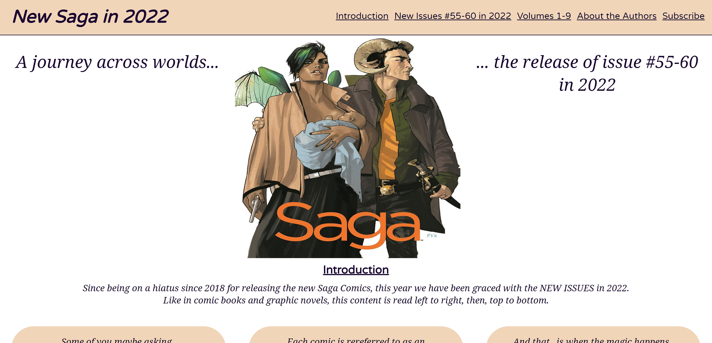

	Head purpose of page includes 'New Saga to 2022' and image of main characters. 
	The focus of the website is about the New Issues released this year after a hiatus, since 2018.

	Includes a head title and the navigation down the page through anchor links.

***
### Table of Contents
* [User Experience](#user-experience)
	- [Wireframe](#wireframe)
* [Features](#features)
	- [Introduction Page](#introduction-page)
	- [New Issues](#new-issues)
	- [Volume 1-9](#volume-1-9)
	- [About the Author](#about-the-author)
	- [Subscribtion Form](#subscribtion-form)
	- [Footer](#footer)
	- [Future features](#future-features)
* [Testing](testing.md)
* [Design](#design)
	- [Colour Scheme](#colour-scheme)
	- [Typography](#typography)
* [Clone Website](#clone-website)
* [Deployment](#deployment)
* [Technologies](#technologies)
***
## User experience	
The general experience should allow the audience to briefly understand how Comics are put togther and read. Then, I have impletmented a large portion of the website to the New Comic Issues this year so they easily avaliable to notice. 
Information can be found about the hiatus both the Writer and Illustrator for the Comic took and a link to find more information is avaiable from the website. Including, the Pulisher of this particular Comic book Series.
An easy subscribtion form can be found to sign up for future details and the footer contains links to look further in their Social aspects and purchasing the Comics themselves.

### **Properties continued throughout website.**
Border-radius continued throughout the webpage for a 'round world' effect.

Pixels height of 10px's increments over the webpage.

Padding increased in 2px increments used where necessary (e.g. 2px, 4px, 6px)

[Back to Top](#new-saga-comic-launch-in-2022)
### Wireframe
Used to design the layour of the website. Final website has been made different to the wireframe provided.
Certain elements such as the, Character gallery, was removed and added to future adapations to the webpage's features.

**Computer View**

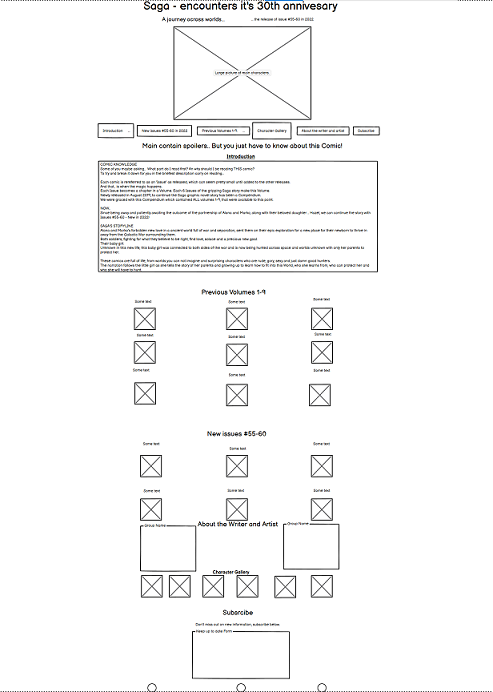

**Mobile Device view.**
 
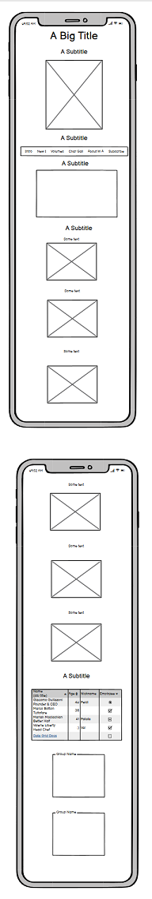
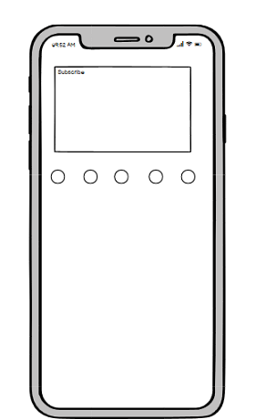

## Removed and change heading titles.
Changed head title through the building of the website to make the focus on the purpose of the website highlight the new releases after a hiatus from 2018 untill 2022.

[Back to Top](#new-saga-comic-launch-in-2022)

***
## Features
### Introduction Page.

Information surrounds general introduction to the storyline of the Saga Comics. Used Flex box to position them how you would read in a comic. Starting from the top and then reading left to right. 
Navigation bar is in a fixed position for use throughout the page as you scroll down.

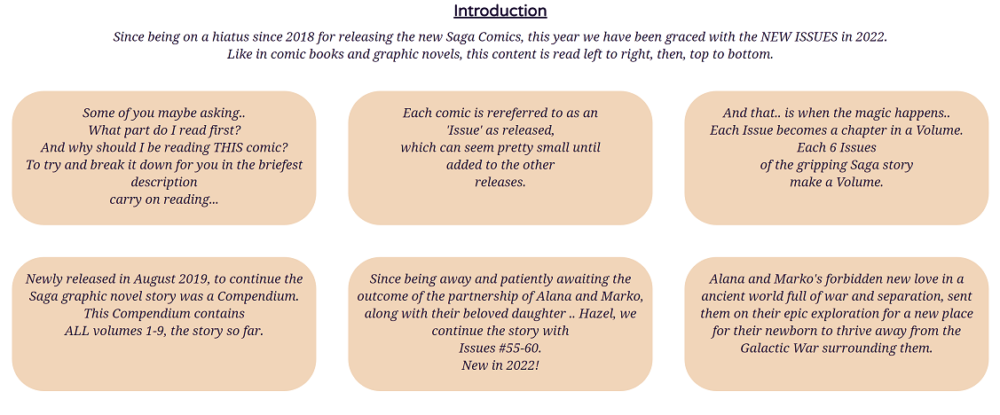
[Back to Top](#new-saga-comic-launch-in-2022)
### New Issues.

Images of the new comic's front page so they can be easy to indentify it needed to find them for purchase.
Issue number and release dates given.

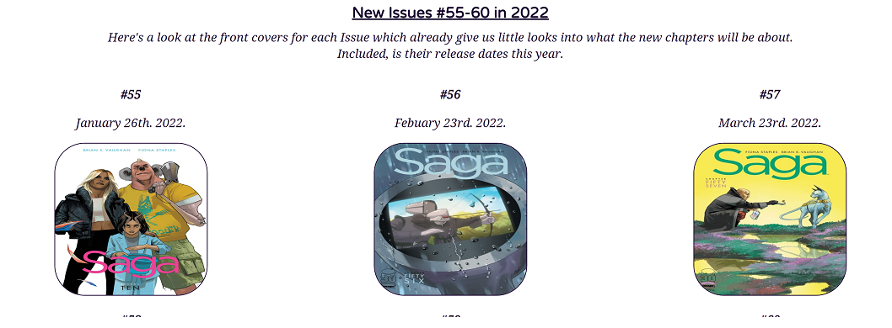
[Back to Top](#new-saga-comic-launch-in-2022)
### Volume 1-9.

Table introduced for this section to show information about their previous releases however, this was not the main focus of the website so thought a simple table of 
information was a good display method.

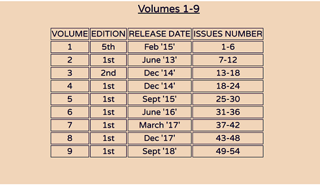

[Back to Top](#new-saga-comic-launch-in-2022)
### About the Author.

Fieldsets used to set the information in a separated design from writer and Artist of the website.
Clickable Icons used for Wikipedia links for further information.

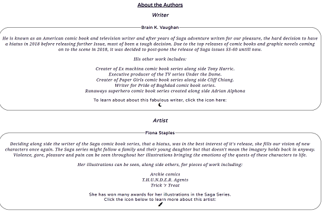
[Back to Top](#new-saga-comic-launch-in-2022)
### Subscribtion Form.

Background image used with Form information over the top. Image used for the background was the final image in volume 9 back in 2018 before the hiatus began.
Purpose of the form is for people to subscribe to get upto date release inforamtion.

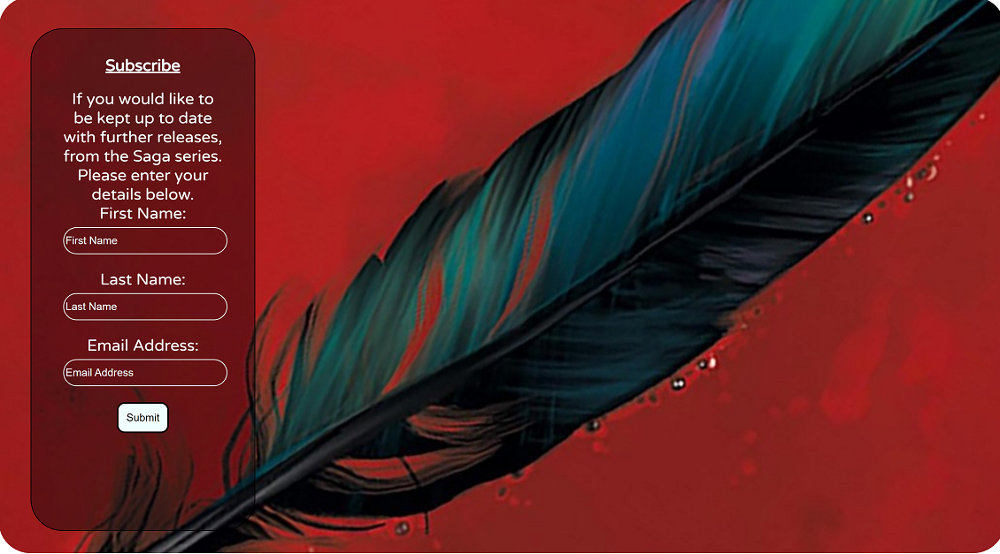
[Back to Top](#new-saga-comic-launch-in-2022)
### Footer.

Included link to the publishers homepage for the Saga Comic series.
Links to their Saga Comic social media platforms on Instagram and Facebook.
Link to purchase the New Issues released in 2022 through Kindle on Amazon. 
All have clickable links via clickable icons.
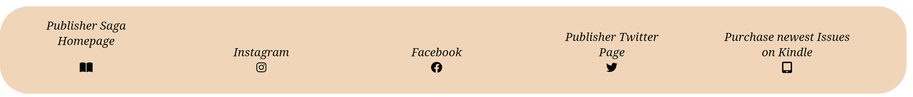

[Back to Top](#new-saga-comic-launch-in-2022)

### 'Back' Form
Title of the comic series and footer included on the form to navigate back to the home screen page. They are added to convey the same sense of the homepage design. Social links are useable on this 'back' page also.

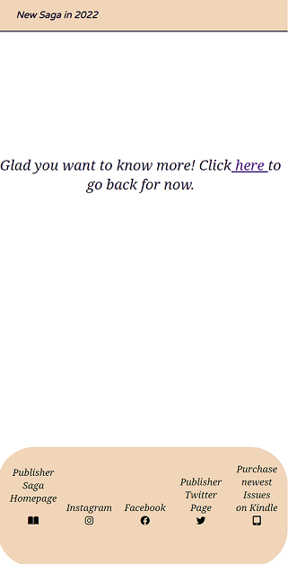

***
### Future Features.
For features to add to this website I would have liked to have added a character gallery to show some more of the illustrations of the Saga Comic Book Series.

***
## Testing.
For Testing Details. Click [here](testing.md).

[Back to Top](#new-saga-comic-launch-in-2022)
***
## Design
### Colour Scheme
The beige to orange colour field continued down into the rest of the page, was used as a subtle hint to the colours in the characters clothing on the landing page image, aswell as the main 'Saga' title in the image.

Colours over page:
* rgba(240, 209, 178, 0.9) (Beige)
* rgb(238, 125, 13) (Orange)
* rgb(29, 7, 51) (Dark Purple, almost black)

The last image which is the background to the Form, is an image used from the Final Chapter of the Comic they released in 2018 before the hiatus. I felt this was a subtle ending to the webpage.
[Back to Top](#new-saga-comic-launch-in-2022)
### Typography
Font used from [Google Fonts](https://fonts.google.com/) website.
The two I choose has subtle differences, giving the paragraphs a font of 'Noto Serif' a more 'floaty' look compared to the more basic fuller rounded main font 'Varela Round'.

[Back to Top](#new-saga-comic-launch-in-2022)

***
## Deployment.
The process involved signing into GitHub pages and opening the repository. 
- Click on the 'settings' button.
- Scroll down to 'Pages' on the lefthand menu.
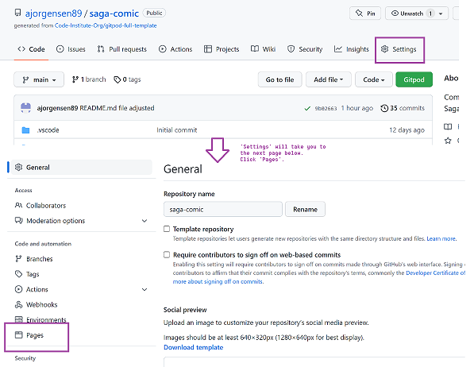
- Changed Deployent branch to main with /root file and then save.

- Wait for the process to become visable on the main repository page for Saga-Comic. Sometimes the webpage my look like the photo below and therefore you have a clickable deployable link avaliable.
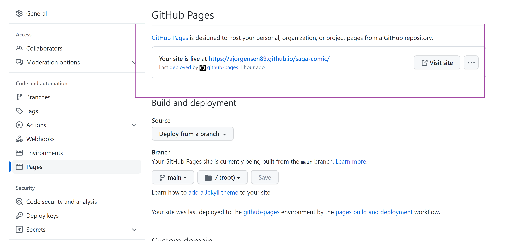

- Click on 'Active' github-pages link underneathe Environments on the Right side of the page. You will notice in the top left corner your Branch is set to Main.
- Click 'View Deployment'
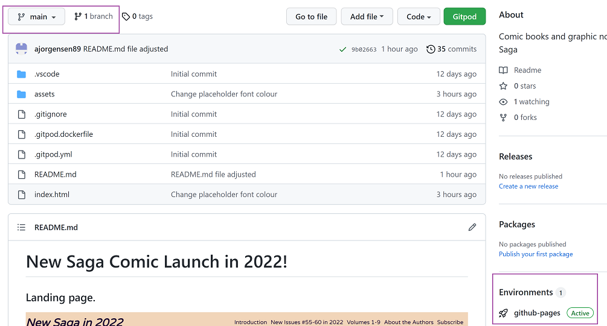

Active link: https://ajorgensen89.github.io/saga-comic/

[Back to Top](#new-saga-comic-launch-in-2022)

## Clone Website.
The process of cloning the website can be seen below.
1. Click the _Code_ button to clone the HTML. 
2. Click the _copy_ link below the code button (shown in the lower purple square on the image below).

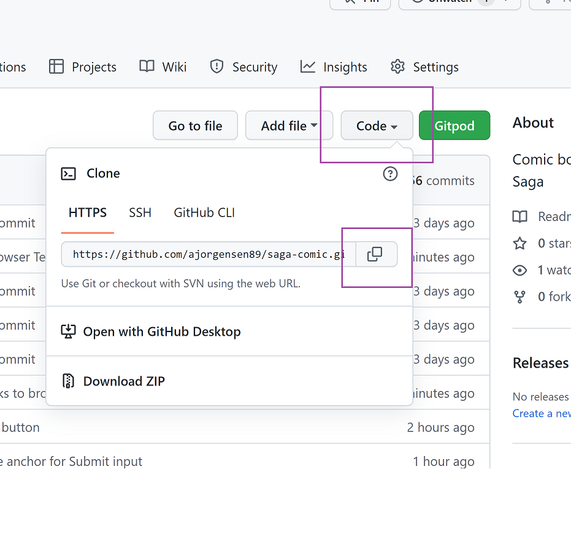

3.Input your url in Git Bash after the _$_ symbol.
Write _git clone_ so it looks like the image below when HTML is inserted. 

Hit _enter_.

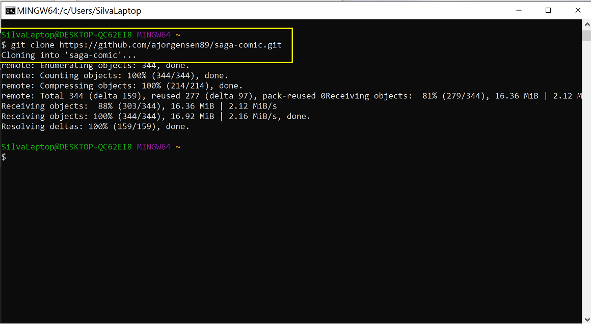 

[Back to Top](#new-saga-comic-launch-in-2022)

***
## Technologies.
Technologies used thoughout this wesbite.
1. [Github](https://github.com/)

2. [Gitpod](https://gitpod.com/)

3. [Code Institute](https://codeinstitute.net/) Course Plan
4. W3C [HTML code Validator](https://validator.w3.org/) and [CSS Code Validator](https://jigsaw.w3.org/)
5. [w3schools](https://www.w3schools.com/) 'How to' information. 
6. [README.md](https://www.ionos.com/digitalguide/websites/web-development/readme-file/) writing assistance.
7. [Balsamiq](https://balsamiq.com/) used to create wireframes. 

[Back to Top](#new-saga-comic-launch-in-2022)

***
### Credits
* Fonts from [Google Fonts](https://fonts.google.com/)
* Icons from [Font Awesome](https://fontawesome.com/)
* Wireframe from [Balsamiq](https://balsamiq.com/)
* Images used from [Amazon](https://www.amazon.co.uk/Saga-55-Brian-K-Vaughan-ebook/dp/B09KMF7S37/ref=sr_1_4?crid=R379XB6DTXWF&keywords=saga+comic+55+issues&qid=1667848064&s=books&sprefix=saga+comic+55+issues%2Cstripbooks%2C74&sr=1-4) where the New Issues for 2022 can be purchase via Kindle.
* Image from [Image Comics](https://imagecomics.com/comics/releases/saga-54) for Landing Page.
* Image from [Image Comics](https://imagecomics.com/comics/releases/saga-1) for Form page.
* Help with [README.md](https://www.w3schools.io/file/github-readme-image/) layout.

[Back to Top](#new-saga-comic-launch-in-2022)
***
### Acknowledgements.
This project was completed as part of my Project One for My Portfolio for the Full Stack Software Developer Course provided by Code Institute.
My Acknowledgements would like to go out to:
- Code Institute course for acceptance into this world.
- Anna Greaves for Love Running module 'run through' over the [Code Institute](https://codeinstitute.net/) Coursework.
- [Slack](https://slack.com/intl/en-gb/) Community for help throughout.
- Mentor Precious Ijege for encourgement to produce better and advise along the way.
- [Image Comics](https://imagecomics.com/comics/series) for comic books release dates and Issue information.
- Tutor Support one the Code Institute Course.

[Back to Top](#new-saga-comic-launch-in-2022)

