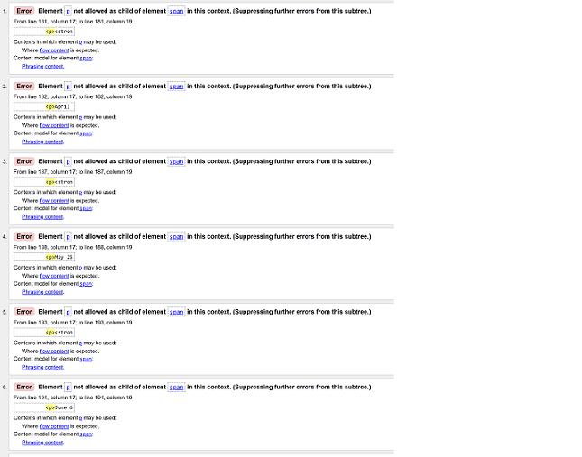

# Testing.
## HTML - Validated on the Official W3C Validator.
### **Bugs fixed.**

Use of _span_ in a number of occasions came back as unsuitable so adapted and changed to _div_.

Image evidence not captured before fixing the bugs encountered here:

Use of _h5_ and _h6_ in certain sections such as _ul_ and _fieldset_ did not pass. 

Use of an _anchor_ element around the _button_ or _input_ elements did not work. I needed to change my form _method_ to _'method="GET"_ instead of _"POST"_ and remove the _anchor_ element. 
Used Tutor Support for this fix.

[Back to Top](#testing)

### **Bugs remaining.**

Error reads for my _script_ input for the Icons attachment however,	it was positioned where stated in course information of the Love Running Project provided by Code Institute. All Icons are linked and working in the deployed website on Github and Gitpod.

## CSS
I faced one bug in my CSS when setting the borders, margins and padding to the _body_ of the website. 
Problem in the CSS.

Fixed the above problem to pass CSS validation.

[Back to Top](#testing)
	
### General
Some general Issues and bugs I faced when creating thie website
* README.md kept deleting my input and not saving. I had used 'git add README.md'.
  I ensured the method of 'git add', 'git commit' and 'git push' was always used to snsure the error stopped.
* Errors - Files and folders for Images and CSS needed their paths correcting as they did not link to the index.html page. I added links to style.css file and to images used in the website.
* Changed font text to look better on the page.
* Issues with setting background image using code from Love Running. Atempted positioning using _'position: relative;'_ and _'position: absolute;'_ in child and parent elements.
* Tried using the method in CSS shown below but had forgotten the _'overflow: hidden;'_ style declaration.
	- #form-set {
    	- background-image: url('../images/red2.jpg');
    	- background-color: rgb(132, 24, 24);
    	- background-repeat: no-repeat;
    	- background-position: center;
    	- background-size: cover;
    	- width:  100%;
    	- height: 700px;
    	- overflow: hidden;}
* To the above CSS I added this input: 
	- height 
	- font-size
	- border-radius.	
* Changing the _'placeholder'_ text colour for the button for the form. Below website assistance used: 
https://www.w3schools.com/howto/howto_css_placeholder.asp
* Managing the correct table positon to adjust over devices was difficult as I could not write the correct code. However, with thanks to [Method 1](https://granneman.com/webdev/coding/css/centertables) on this link, I was able to set the _margins-left_ and _margin-right_ to _auto_ to get this positioning to adjust.

[Back to Top](#testing)

### Browser Testing.
All loading, appearance and functionality tested and were avaliable to view while on the following browser including, [Microsoft Edge](https://www.microsoft.com/en-us/edge?form=MA13FJ), [Google Chrome](https://www.google.co.uk/chrome/), [Opera](https://www.opera.com/) and [ Mozilla Firefox](https://www.mozilla.org/en-GB/firefox/new/).

Loading problems were found with [Safari](https://www.apple.com/uk/safari/) due to my iOS not supporting Safari.

[Back to Top](#testing)

***
## Lighthouse Overview. Pictured below.

 

[Back to Top](#testing)
## Chrome Devtools 
Was used for a brief look of the website. Included in this view is the General Overview and Colour chart. (Orange colour for the _hover_ attribute not included in chart)
 

[Back to Top](#testing)

## Am I responsive.
I used this website to test the view on various devices.
[Am I responsive?](https://ui.dev/amiresponsive) 

***
[Back to Top](#testing) 
***
[Back to README.md file](README.md)
***